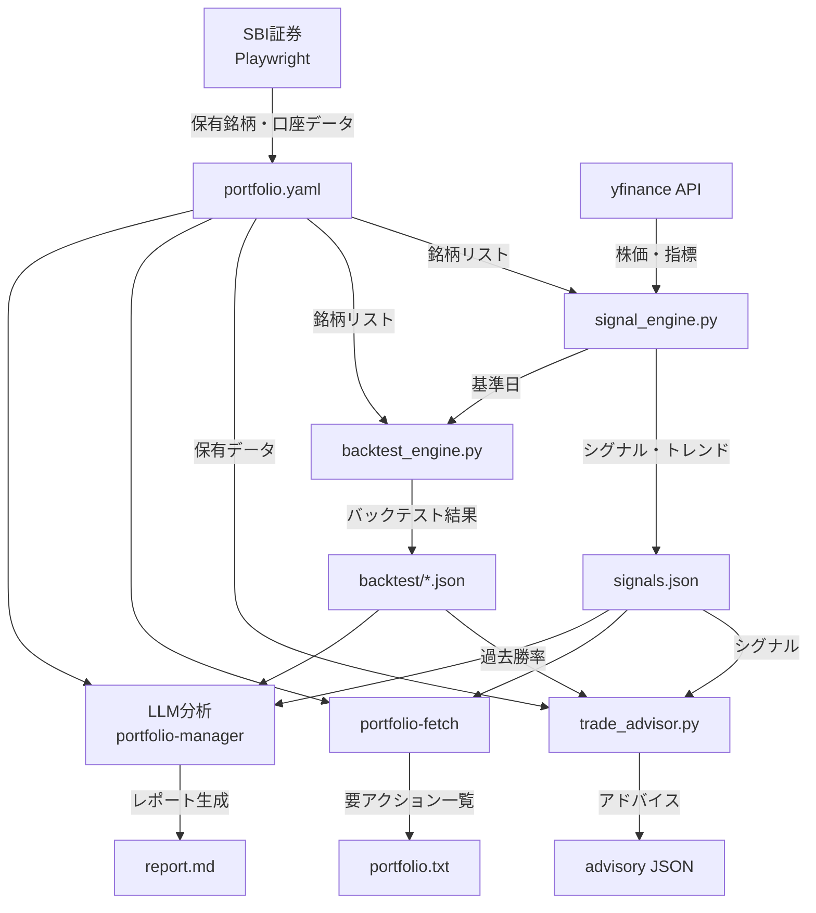
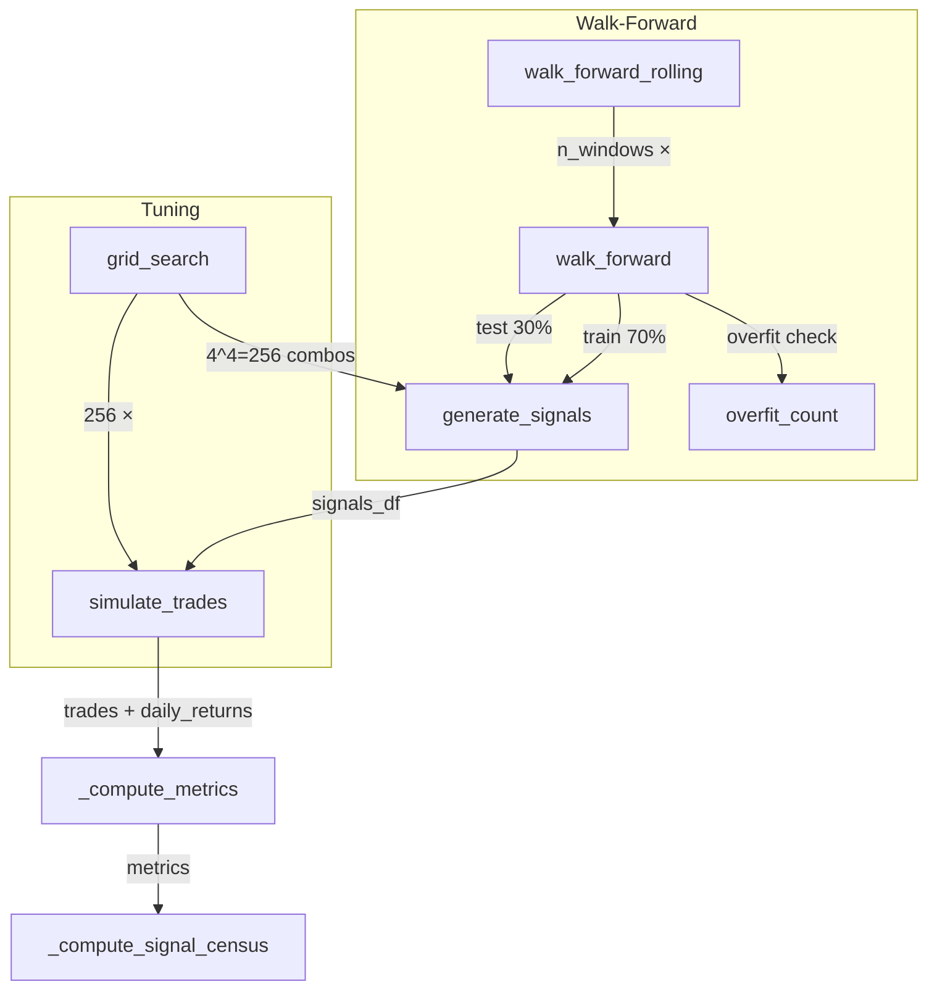

# stock-advisor システム仕様書

> 日本株ポートフォリオ分析・取引判断支援システム
> Version: 2026-05-28 | ファイル: `~/.claude/skills/stock-advisor/`

---

## 1. システム概要

### 1.1 全体アーキテクチャ



### 1.2 モジュール一覧

| モジュール | ファイル | 行数 | 責務 |
|-----------|---------|------|------|
| **シグナルエンジン** | `signal_engine.py` | ~624 | 指標計算・シグナル判定・アナリスト評価 |
| **バックテストエンジン** | `backtest_engine.py` | ~1740 | 過去シグナル生成・取引シミュレーション・WF分析 |
| **トレードアドバイザー** | `trade_advisor.py` | ~844 | 保有ポジション評価・取引推奨スコアリング |
| **データユーティリティ** | `data_utils.py` | ~240 | yfinanceラッパー・OHLCVキャッシュ・指標計算 |
| **シグナル定数** | `signal_rules.py` | 38 | 閾値定数の一元管理 |
| **バックテストキャッシュ** | `backtest_cache.py` | 130 | 結果キャッシュ・コンテンツハッシュ無効化 |
| **ポートフォリオ取得** | `fetch_portfolio.py` | ~860 | SBI同期(Playwright)・時価・リスク計算 |
| **認証** | `auth_sbi.py` | 98 | SBIセッションCookie管理 |
| **スキル定義** | `SKILL.md` | ~320 | ワークフロー手順・分析ルール・レポート形式 |

### 1.3 データフロー

```
[SBI証券] ──Playwright──→ portfolio.yaml ──→ 全モジュールの銘柄リスト
[yfinance] ─→ data_utils ─→ signal_engine ─→ signals.json
[yfinance] ─→ data_utils ─→ backtest_engine ─→ backtest/*.json

stock-advisor実行時:
  1. fetch_portfolio → portfolio.txt (時価・リスク・要アクション一覧)
  2. signal_engine → signals.json (シグナル・トレンド・スコア)
  3. backtest_engine × N銘柄 → backtest/*.json (WF・VaR・Sharpe CI)
  4. LLM分析 → report.md (取引判断)
```

---

## 2. データ取得パイプライン

### 2.1 SBI同期（Playwright）

```
処理フロー:
┌─────────────┐    ┌──────────────┐    ┌──────────────────┐
│ .cookie読込  │───→│ Playwright    │───→│ HTMLパース       │
│ (JSON/文字列) │    │ headless Chr. │    │ (正規表現マッチ)  │
└─────────────┘    └──────────────┘    └──────────────────┘
                                              │
                    ┌─────────────────────────┘
                    ▼
              ┌──────────┐    ┌───────────────┐
              │ merge    │───→│ portfolio.yaml │
              │ (SBI優先) │    │ 上書き保存     │
              └──────────┘    └───────────────┘
```

**Cookieソース優先順位**: `SBI_COOKIE` 環境変数 → `~/.claude/skills/portfolio-auth/.cookie`

**マージルール**:
- SBIデータは数量・時価・口座残高の正（`is not None` で上書き）
- 既存の `open_date`, `expiry_date`, `credit_type` は保持
- SBIに存在しない保有は自動削除
- SBI保有数が既存の50%未満の場合は安全ガードでマージ中止

### 2.2 yfinance データフロー

```
load_ohlcv(symbol, curr_date, max_date)
  ├─ キャッシュチェック (24h TTL, CSV)
  ├─ 未キャッシュ時: yf.download(5年分)
  ├─ アトミック書込 (tempfile → shutil.move)
  ├─ _clean_dataframe (日付正規化, 欠損補完)
  └─ curr_date以降のデータを除外 (先読みバイアス防止)

_get_stock_stats_bulk(symbol, indicator, curr_date)
  ├─ プロセス内キャッシュ (_indicator_cache)
  ├─ load_ohlcv → stockstats.wrap → 指標計算
  └─ dict[日付] = 指標値 で返却
```

### 2.3 バックテスト結果キャッシュ

```
backtest_cache.py
├─ キャッシュキー: (ticker, strategy, start_date, end_date)
├─ TTL: 86400秒 (24h, --cache-ttlで調整可)
├─ コンテンツハッシュ: signal_rules.py + DEFAULT_THRESHOLDS のSHA256
│  └─ ソース変更時はキャッシュ自動無効化
├─ アトミック書込 (tempfile + fsync + shutil.move)
└─ --no-cache でバイパス可能
```

---

## 3. シグナルエンジン

### 3.1 17指標一覧

#### stockstats標準指標 (12)

| # | 指標 | コード | 計算式 | パラメータ |
|---|------|--------|--------|-----------|
| 1 | RSI | `rsi` | RSI = 100 - 100/(1+RS)<br/>RS = 14日平均上昇幅 / 14日平均下落幅 | period=14 |
| 2 | MACD | `macd` | MACD = EMA(12) - EMA(26) | fast=12, slow=26 |
| 3 | MACD Signal | `macds` | MACDのEMA(9) | signal=9 |
| 4 | MACD Histogram | `macdh` | MACD - MACD Signal | — |
| 5 | Bollinger Middle | `boll` | SMA(20) | period=20 |
| 6 | Bollinger Upper | `boll_ub` | SMA(20) + 2 × σ(20) | period=20, std=2 |
| 7 | Bollinger Lower | `boll_lb` | SMA(20) - 2 × σ(20) | period=20, std=2 |
| 8 | ATR | `atr` | ATR(14) = Wilder's smoothed TR | period=14 |
| 9 | VWMA | `vwma` | Σ(close × volume) / Σ(volume) (20日) | period=20 |
| 10 | MFI | `mfi` | 100 - 100/(1 + Money Ratio)<br/>MR = 14日累積Positive MF / 14日累積Negative MF | period=14 |
| 11 | SMA-50 | `close_50_sma` | SMA(50) | period=50 |
| 12 | SMA-200 | `close_200_sma` | SMA(200) | period=200 |

#### カスタム指標 (5)

| # | 指標 | コード | 計算式 |
|---|------|--------|--------|
| 13 | 5日リターン | `5d_return` | `close.pct_change(5) × 100` |
| 14 | 10日リターン | `10d_return` | `close.pct_change(10) × 100` |
| 15 | 20日リターン | `20d_return` | `close.pct_change(20) × 100` |
| 16 | 52週位置 | `52w_position` | `(close - 52w_low) / (52w_high - 52w_low) × 100` |
| 17 | 出来高比率 | `volume_ratio` | `volume / SMA(volume, 20)` |

### 3.2 8シグナルルール (2パスアーキテクチャ)

**Pass 1: BUYルール**（先勝ち）

```
oversold_reversal → momentum → trend_following → ma_support_bounce
```

| # | ルール | 条件 | 強度グレード |
|---|--------|------|------------|
| 1 | **oversold_reversal** | RSI < 30 かつ close ≤ boll_lb × 1.02 かつ 52w位置 < 25% | strong: BB直近+vol>1.2<br/>moderate: BB-5%以内<br/>weak: その他 |
| 2 | **momentum** | 5日リターン > 7% | strong: vol>1.5<br/>moderate: vol>1.0<br/>weak: その他 |
| 3 | **trend_following** | SMA50 > SMA200 かつ close > SMA50<br/>かつ 10日リターン > 3% | strong: vol>1.2<br/>moderate: その他 |
| 4 | **ma_support_bounce** | SMA50 > SMA200 かつ SMA50×0.98 ≤ close ≤ SMA50×1.02<br/>かつ RSI < 45 | moderate: RSI<35<br/>weak: その他 |

**Pass 2: SELLルール**（先勝ち、BUY上書き）

```
overbought → momentum_breakdown → drawdown_stop → death_cross
```

| # | ルール | 条件 | 強度グレード |
|---|--------|------|------------|
| 5 | **overbought** | RSI > 70 かつ 52w位置 > 85% | strong: RSI>80+vol>1.2<br/>moderate: その他 |
| 6 | **momentum_breakdown** | 5日リターン < -7% かつ vol > 1.5 | strong: vol>2.0<br/>moderate: vol>1.5<br/>weak: vol>1.0 |
| 7 | **drawdown_stop** | 20日リターン < -15% | strong: <-20%<br/>moderate: <-15% |
| 8 | **death_cross** | 0.99 ≤ SMA50/SMA200 ≤ 1.01<br/>かつ SMA50 < SMA200<br/>かつ close < SMA50 | strong |

**トレンドフィルター**: strong_downtrend では oversold_reversal を抑制（逆張り買いリスク管理）

### 3.3 トレンド状態判定

```
compute_trend_state(close, sma_50, sma_200, ret_20d)

if close > sma_50 > sma_200 and ret_20d > 5   → strong_uptrend
elif close > sma_50                              → weak_uptrend
elif close < sma_50 < sma_200 and ret_20d < -5 → strong_downtrend
elif close < sma_50                              → downtrend
else                                             → ranging
```

### 3.4 総合スコアリング

```
スコア = Σ(シグナル重み) + アナリスト乖離ボーナス

BUYシグナル: strong=+20, moderate=+10, weak=+5
SELLシグナル: strong=-25, moderate=-15, weak=-5
アナリスト乖離: >25%割安 → +10, >15%割高 → -10

推奨:
  >= 20 → STRONG_BUY
  15〜19 → HOLD_BUY
  -14〜14 → HOLD
  -15〜-19 → HOLD_SELL
  <= -20 → SELL
```

---

## 4. バックテストエンジン

### 4.1 実行フロー



### 4.2 取引シミュレーション (simulate_trades)

```
状態機械:
  position ∈ {0(flat), 1(long), -1(short)}

日次ループ:
  1. 日次リターン計算 (前日position基準)
  2. 実現ボラティリティ更新 (20日窓)
  3. ボラティリティ乗数計算
     vol_multiplier = clamp(vol_target / realized_vol, 0.5, 2.0)
     ポジションサイズ = clamp(round(100 × vol_multiplier / 100) × 100, 100, 200)
  4. 信用コスト計上 (entry_price × actual_shares × rate/365)
  5. トレーリングストップ判定 (ATRベース)
  6. 信用期限チェック (180日期限)
  7. シグナル処理 (2パス, SELLがBUYを上書き)
  8. 約定遅延 (--execution-delay指定時: T+1執行)

取引終了時:
  - 建玉決済 (_close_position)
  - 取引コスト計上 (commission + slippage + market impact)
```

### 4.3 取引コストモデル

```python
commission = notional × 0.1% × 2  # 往復
slippage = notional × (0.05% if topix500 else 0.15%) × 2
impact = min(√(vol_ratio) × impact_mult × notional, 2.0% × notional)
# impact_mult: 0.15% (topix500) / 0.30% (other)

総コスト = commission + slippage + impact
```

**TOPIX500判定**: 88銘柄のハードコードセットで判定

### 4.4 パフォーマンス指標一覧

#### 基本指標

| 指標 | 計算式 | 説明 |
|------|--------|------|
| **Sharpe Ratio** | `avg(daily_return) / std(daily_return) × √252` | リスク調整後リターン (Rf=0) |
| **Sortino Ratio** | `avg(dr) / std(dr[dr<0]) × √252` | 下方リスクのみ考慮 |
| **CAGR** | `(total_return + 1)^(1/years) - 1` | 年率複利成長率 |
| **Max Drawdown** | `max((peak - e) / peak) × 100` | 最大ピークトゥトラフ下落率 |
| **Calmar Ratio** | `CAGR / MaxDD` | ドローダウン対リターン |
| **Win Rate** | `win_count / total_trades × 100` | 勝率(%) |
| **Profit Factor** | `Σ(win) / |Σ(loss)|` | 総利益/総損失 |
| **Total Return** | `equity[-1] - 1.0` | 累積リターン |

#### テールリスク指標

| 指標 | 計算式 |
|------|--------|
| **VaR 95%** | `percentile(daily_returns, 5) × 100` |
| **VaR 99%** | `percentile(daily_returns, 1) × 100` |
| **CVaR 95%** | `mean(dr[dr ≤ VaR_95]) × 100` |
| **CVaR 99%** | `mean(dr[dr ≤ VaR_99]) × 100` |
| **Skewness** | `Σ(x - μ)³ / (n × σ³)` |
| **Kurtosis** | `Σ(x - μ)⁴ / (n × σ⁴) - 3` (超過尖度) |

#### 統計的有意性

| 指標 | 計算式 |
|------|--------|
| **Sharpe CI** | ブートストラップ1000回リサンプリングの2.5/97.5パーセンタイル |
| **Deflated Sharpe** | `Sharpe × (1 - 0.05/256)` — Bonferroni補正 (256グリッドサーチ分) |

#### シグナル評価

| 指標 | 説明 |
|------|------|
| **シグナル別勝率** | 各ルールのトレード勝率 |
| **シグナル強度分布** | strong/moderate/weak の頻度 |
| **平均保有日数** | シグナルの有効期間 |
| **MFE Capture %** | 最大含み益の何%を実現できたか |
| **Exit Efficiency** | 出口タイミングの効率性 |

### 4.5 ウォークフォワード分析

```
walk_forward_rolling(ticker, start, end, n_windows=3, embargo_days=5)
  │
  ├─ 逐次非重複窓生成
  │   per_window_range = total_days // n_windows
  │   window_k: start + k×per_window_range 〜 start + (k+1)×per_window_range
  │
  ├─ 各窓で walk_forward():
  │   train = 70% (窓の前半)
  │   test  = 30% (窓の後半)
  │   embargo = 5日 (train/test間のパージング)
  │
  ├─ 過学習検出:
  │   train_sharpe - test_sharpe
  │   |—————————————| × 100 > overfit_threshold (50%)
  │       train_sharpe
  │   OR test_sharpe < 0
  │
  └─ 評決:
      overfit_count == n_windows → insufficient_data
      overfit_count > 0          → unstable
      overfit_count == 0, std<0.5 → robust
      overfit_count == 0, std≥0.5 → stable
```

### 4.6 グリッドサーチ

```
TUNE_PARAM_GRID = {
    "rsi_lower": [20, 25, 30, 35],
    "rsi_upper": [65, 70, 75, 80],
    "position_52w_lower": [15, 20, 25, 30],
    "position_52w_upper": [80, 85, 90, 95],
}
全組み合わせ: 4⁴ = 256通り
各組み合わせで generate_signals + simulate_trades
Sharpe降順でソート
```

---

## 5. リスク管理

### 5.1 トレーリングストップ

```
ATRマルチプライヤ (トレンド状態別):
  strong_uptrend:     5.0× ATR
  weak_uptrend:       4.0× ATR
  ranging:            3.0× ATR
  downtrend:          2.5× ATR
  strong_downtrend:   2.0× ATR

スルー制限: atr_slew_max = 0.5/日
  └─ 急激なマルチプライヤ変化を防止

ロング: stop_level = highest_since_entry - (ATR × mult)
ショート: stop_level = lowest_since_entry + (ATR × mult)

制約: 終値のみで判定（日中ギャップダウンは捕捉不可）
```

### 5.2 ポジションサイジング

```
vol_multiplier = clamp(vol_target / realized_vol, 0.5, 2.0)
  vol_target = 0.15 (15%年率目標ボラティリティ)
  realized_vol = 直近20日ローリング実現ボラティリティ

actual_shares = clamp(round(100 × vol_multiplier / 100) × 100, 100, 200)
  └─ 100株単位、下限100株、上限200株
```

### 5.3 信用取引

```
コスト:
  買建: 年率 2.8% (日割り: entry_price × shares × 0.028 / 365)
  売建: 年率 1.2%

期限: 180日 (margin_max_days)
  └─ 超過時は強制決済

口座全体: margin_ratio = 実質保証金(A) / 建代金合計(B) × 100
  └─ 20%割れで追証リスク
```

---

## 6. 運用パイプライン

### 6.1 stock-advisor 実行フロー

```
Step 0: 環境セットアップ
  └─ setup_env (venv確認)

Step 1: データ取得
  ├─ SBI同期 (Playwright → portfolio.yaml更新)
  └─ 時価・指標・シグナル → portfolio.txt

Step 1.5: 注目銘柄読込
  └─ watchlist.yaml → 分析対象に追加

Step 2: シグナル検出
  └─ signal_engine --all → signals.json

Step 2 (続): バックテスト
  ├─ signals.jsonから基準日取得
  ├─ 保有銘柄 × backtest_engine (3年, default戦略)
  └─ 注目銘柄 × backtest_engine

Step 3: レポート生成 (LLM分析)
  ├─ portfolio.yaml (時価SBI正)
  ├─ signals.json
  ├─ backtest/*.json (VaR/CVaR, Sharpe CI, WF)
  └─ → report.md
```

### 6.2 レポート必須項目

```
## 株式分析 YYYY-MM-DD

### 総括
- VIX / S&P500 / USDJPY / 米10年債
- ポートフォリオ評価額 / 現金 / 信用倍率

### 銘柄別詳細 (シグナルあり・スコア≥15のみ)
現在値: (portfolio.yaml current_price 正)
目標価格 / 損切り価格
短期見通し (1-4週)
中期見通し (1-6ヶ月)
リスク指標: VaR 95% / CVaR 95% / Skewness / Kurtosis
バックテスト: Sharpe CI / Deflated Sharpe / WF判定
所見: シグナル + リスク指標 + WF + 取引判断

### 注目銘柄
| Ticker | 現在値 | 目標ENT | 乖離 | シグナル | Trend | 判断 |

### 優先アクション (重要順)
### 信用期限アラート
```

---

## 付録A: 定数一覧 (signal_rules.py)

| 定数 | 値 | 用途 |
|------|-----|------|
| `RSI_LOWER` | 30 | 売られ過ぎ閾値 |
| `RSI_UPPER` | 70 | 買われ過ぎ閾値 |
| `POSITION_52W_LOWER` | 25 | 52週安値圏 (%) |
| `POSITION_52W_UPPER` | 85 | 52週高値圏 (%) |
| `MOMENTUM_5D` | 7.0 | モメンタムBUY閾値 (%) |
| `MOMENTUM_STRONG_VOL` | 1.5 | strong判定の出来高倍率 |
| `BREAKDOWN_5D` | -7.0 | ブレイクダウンSELL閾値 (%) |
| `BREAKDOWN_VOL_GATE` | 1.0 | signal_engine用出来高閾値 |
| `BREAKDOWN_VOL` | 1.5 | backtest_engine用出来高閾値 (厳格) |
| `DRAWDOWN_20D` | -15.0 | ドローダウンストップ閾値 (%) |
| `BB_PROXIMITY` | 1.02 | BB下限近接判定 |

## 付録B: ディレクトリ構成

```
~/.claude/skills/stock-advisor/
├── SKILL.md                    # スキル定義・ワークフロー手順
├── SPEC.md                     # 本仕様書
├── watchlist.yaml              # 注目銘柄リスト
├── scripts/
│   ├── signal_engine.py        # シグナルエンジン
│   ├── backtest_engine.py      # バックテストエンジン
│   ├── backtest_cache.py       # バックテスト結果キャッシュ
│   ├── trade_advisor.py        # トレードアドバイザー
│   ├── data_utils.py           # データユーティリティ
│   ├── signal_rules.py         # シグナル定数
│   ├── run_signal_engine       # CLIラッパー
│   ├── setup_env               # venv初期化
│   ├── cache/                  # OHLCV CSVキャッシュ
│   │   └── backtest/           # バックテストJSONキャッシュ
│   └── tests/                  # テスト
├── ~/.claude/skills/portfolio-fetch/
│   └── scripts/fetch_portfolio.py  # SBI同期・ポートフォリオ取得
└── ~/.claude/skills/portfolio-auth/
    ├── auth_sbi.py             # SBI認証
    └── .cookie                 # セッションCookie
```

## 付録C: バックテストJSON出力構造

```json
{
  "ticker": "7974.T",
  "period": {"start": "2023-05-28", "end": "2026-05-28"},
  "resolved_end_date": "2026-05-28",
  "default_thresholds": {...},
  "default_risk_params": {...},
  "benchmark": {"cagr": ..., "max_drawdown": ..., "sharpe_ratio": ...},
  "baseline": {
    "sharpe_ratio": 0.42,
    "var_95": -1.84, "var_99": -3.69,
    "cvar_95": -3.17, "cvar_99": -5.33,
    "skewness": -0.20, "kurtosis": 9.39,
    "sharpe_ci_lower": -0.41, "sharpe_ci_upper": 1.91,
    "deflated_sharpe": 0.73,
    "trades": [{"shares": 100, "signal_strength": "moderate", ...}],
    "signal_census": {"momentum": {"win_rate": 68.5, "count": 12}, ...},
    "regime_breakdown": {...}
  },
  "walk_forward": {
    "rolling_windows": [
      {"window": 0, "train_start": "...", "test_end": "...", "overfit_detected": true},
      ...
    ],
    "consensus": {
      "mean_sharpe": -0.04, "std_sharpe": 1.88,
      "overfit_count": 2, "verdict": "unstable"
    }
  }
}
```
